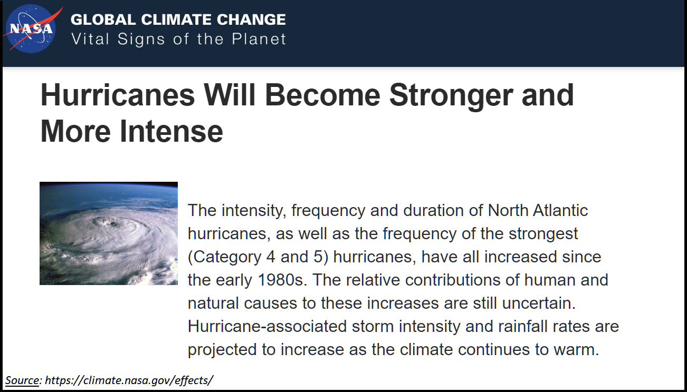

# Global Warming | 164-year History of Hurricanes
## 1. Background
Global Warming with its effects on human lives and other creatures on planet Earth has always been a controversial topic for the past many decades and no doubt would remain one of the hottest topics for many more years to come. One of the infamous effects of Global Warming is devastating storms. NASA claimed that due to Global Warming, "Hurricanes will become stronger and more intense". Whether this is true or not, let's explore and ask data to speak the truth.

In this project, tropical storms/ hurricanes data from 1851 – 2015 were processed, cleaned, analyzed and visualized by utilizing Python.

## 2. Data and Research Sources
Sources utilized for data, articles, and topic researches:
   - www.NASA.gov
   - www.NOAA.gov
   - www.Kaggle.com

Dataset in for this project was downloaded <a href="https://www.kaggle.com/noaa/hurricane-database" alt="go to Kaggle and search for hurricane data">here.</a>

## 3. Table of Contents
Folders / Files | Descriptions
--------------- | ------------
Database | raw Atlantic & Pacific storm data downloaded from Kaggle
Images | plots made by each teammates for different analysis & NASA article snapshot
Jupyter Notebooks | all JPNBs developed for data clean up, and chart creation
Project Planning | Word document to lay-out project steps and processes
Final Presentation.pptx | team final presentation about findings after completing all analyses

## 4. Languages, Software & Technologies
* **Languages**:
  * Python
  * Shell/ Bash Scripts
* **Libraries**/ **Modules**:
  * Pandas | Matplotlib | Numpy | Scipy | Seaborn | Gmaps | Datetime
* **Operating** **Systems**:
  * Windows 10 Pro | macOS Mojave
* **Software** | **Applications**:
  * Visual Studio Code | Jupyter Notebook | MS PowerPoint | Google Chrome v. 84 | Git Bash

## 5. Jupyter Notebooks
* **Data_Cleaning_Codes**: raw data processing and cleaning. Cleaned data then exported for further analyses.
   
* **OJ_Work.ipynb**:   
  * Create PiePlot of Top 10 Hurricane Active Duration.
  * Create Moving Average Line Plot of Hurricane (1851 - 2015).
    
* **SSutar_Work.ipynb**:  
  * Categorize storms by windspeed.
  * Create bar chart to show the category and how many time each occured.
  * Plot monthly distribtution of hurricanes.

* **HLe_Work.ipynb**:  
   * Categorize hurricanes by windspeeds (by binning).
   * Create bar charts for hurricane categories # 3, 4, 5 and number of occurence in the past for 25/ 50 yrs.
   * Create box plot of all hurricane categories from 1 to 5: identify outliers, mean, standard errors.
   * Create bar chart for observing tropical storm events in the past 50 years.
   * Create "gmaps" plot with add-on layer for showing locations of all hurricanes for the past 10 years. 

## 6. Presentation of Findings
File name : **Team_4_Proj_1.pptx**.
- Overview of project ideas, team-members, agenda.
- Summary of results from all analyses performed, including data visualizations.
- Conclusions, challenges and ideas for more future in-depth analyses.

## 7. Usage
* Environment in this project was created using conda
  * `conda create --name <any-env-name> python=3.7`
  * `conda activate <env-name-created-above>`
* Install any missing libraries/ modules as per section 4 above by `pip install`.
* This repository contains all data and source codes needed for replication. Simply do: 
  * `git clone https://github.com/henryle-n/Global-Warming.git`
* Data was found on Kaggle by searching keyword `hurricane data`
